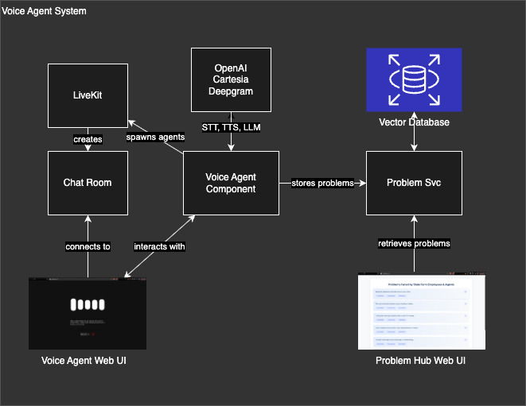

# Problem

The 3,000 ET engineers and managers at State Farm are too disconnected from the problems of the company’s 80,000 other employees and agents. 

# Solution 

A Voice Bot for Problem Discovery—a conversational AI that engages employees and agents on a regular basis, collects their problems in natural language, and saves them to a centralized "Problem Hub," where they can be easily accessed by anyone at any time.

# Infra overview 



# Setup Instructions 

1. **Create and activate a virtual environment:**

    ```bash

    python -m venv venv

    # On Windows:

    venv\Scripts\activate

    # On macOS/Linux:

    source venv/bin/activate

    ```

2. **Install Python dependencies:**

    ```bash

    pip install -r requirements.txt

    ```

3. **Install Voice UI dependencies:**

    ```bash

    cd voice-ui

    npm install

    cd ..

    ```

# Running the Application

## 1. Start the Chat Room

```bash

cd voice-ui

npm run build

npm start

cd ..

``` 

## 2. Start the Agent

```bash

python agent/agent.py start

```

## 3. Populate the Database with Mocked Convos

```bash

python db/mock/extract_problems_script.py

```

## 4. Run Problem Hub UI

 ```bash

python insights-ui/ui.py

```